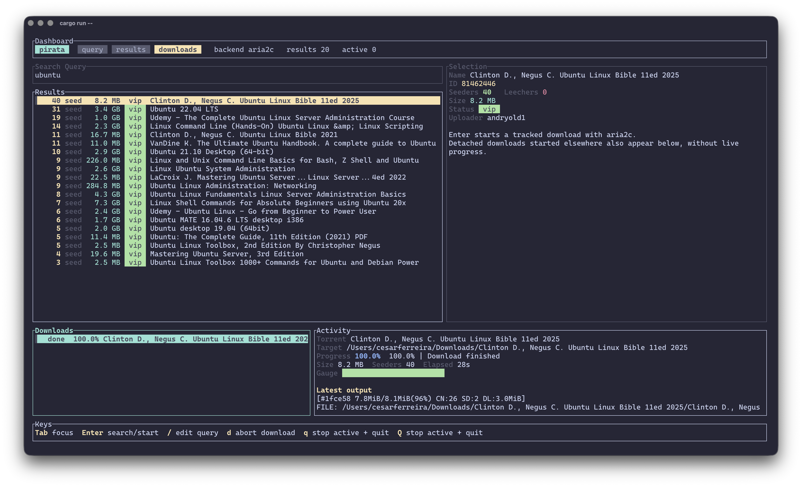

# pirata



A torrent CLI with a TUI-first flow.

## Fast Paths

- `pirata` launches the full-screen TUI
- `pirata tui ubuntu` opens the TUI with a prefilled query
- `pirata lucky "ubuntu 24.04"` picks the best match and starts downloading
- `pirata add 81462446` downloads a known torrent id directly
- `pirata search "ubuntu 24.04" --interactive` keeps the one-shot interactive picker

Short aliases are available for the common commands:

- `pirata s ...`
- `pirata i ...`
- `pirata m ...`
- `pirata a ...`
- `pirata l ...`
- `pirata t ...`

By default, `search --interactive`, `add`, and `lucky` run `aria2c` in the foreground and wait for the download to finish. If you switch to the `transmission` downloader, those commands use the configured Transmission client instead.

## Build

```bash
cargo install --path .
pirata --help
```

## Setup

If no config exists, `pirata` starts a first-run setup wizard before running your command.

Run setup explicitly:

```bash
pirata setup
pirata setup --download-dir ~/Downloads/torrents
```

Check local dependencies and active config source:

```bash
pirata doctor
pirata --json doctor
```

## TUI

Full-screen search plus live download activity:

```bash
pirata
pirata tui
pirata tui ubuntu
pirata tui "ubuntu 24.04" --sort seeders
```

Downloads started inside the TUI show live progress and can run in parallel. Completed downloads are persisted locally and reloaded on the next launch as long as their file or folder still exists on disk.

Keys:

- `Tab`: cycle focus between query, results, and downloads
- `Up` / `Down` or `j` / `k`: move
- `Enter`: search or start selected download
- `/`: start a fresh search
- `d`: abort selected managed download
- `q` or `Esc`: stop active foreground downloads and quit
- `Q`: stop active foreground downloads and quit

## Search

```bash
pirata search "ubuntu 24.04"
pirata search "ubuntu 24.04" --sort seeders
pirata search "ubuntu 24.04" --interactive
pirata search "ubuntu 24.04" --json
```

## Info and Magnet

```bash
pirata info 81462446
pirata magnet 81462446
pirata magnet 81462446 --json
```

## Add

```bash
pirata add 81462446
pirata add 81462446 --downloader system
pirata add 81462446 --open
```

## Lucky

```bash
pirata lucky "ubuntu server 24.04"
pirata lucky "ubuntu server 24.04" --dry-run
pirata lucky "ubuntu server 24.04" --min-seeders 5 --trusted-only
pirata lucky "ubuntu server 24.04" --min-size 1GB --max-size 5GB
```

## Global Flags

```text
--json
--indexer piratebay
--downloader transmission|qbittorrent|aria2|system
--config ~/.config/pirata/config.toml
--open
```

## Config Path

Default config path:

```text
~/.config/pirata/config.toml
```

Legacy `~/.config/pirate-ctl/config.toml` is still read as a fallback.

## Useful Commands

```bash
cargo fmt
RUSTC_WRAPPER= cargo check
RUSTC_WRAPPER= cargo test
pirata doctor
pirata lucky ubuntu
pirata tui ubuntu
```
