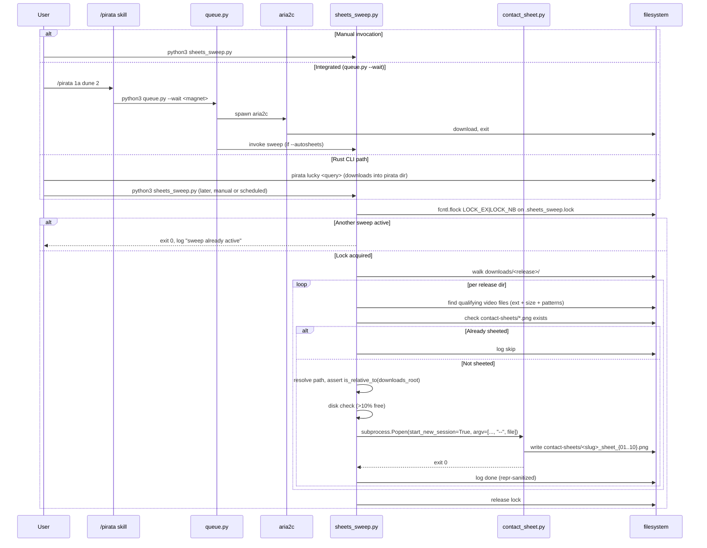

# Auto-generate contact sheets via opportunistic sweep

## Overview

A tiny sweeper (`scripts/sheets_sweep.py`, ~80 lines) that walks `downloads/` looking for release directories containing a qualifying video file but no `contact-sheets/` sibling, and invokes the existing `scripts/contact_sheet.py` on each. Runs sequentially, idempotent by construction, works for downloads from **any** source (aria2c via `queue.py`, Rust `pirata` CLI, manual drops, Drive sync, AirDrop). Opt-in integration with `queue.py --wait` for zero-latency invocation after a synchronous download; otherwise manual or scheduled.

## Problem Frame

The user has a cinema-grade contact sheet pipeline (`scripts/contact_sheet.py`) and runs it manually after each download. The motivation is: don't make the user track what's been sheeted. The original plan was an event-driven aria2c-hook pipeline with flock, state sidecar, process groups, layered security gates, and DOCTOR/STATUS panel surfacing. A document-review pass surfaced three decisive concerns:

1. **Architectural hole**: pirata ships a Rust CLI (`pirata lucky`, `pirata search`) that bypasses `queue.py` entirely. A queue.py-anchored hook never fires for those downloads — 50%+ of the real usage path.
2. **Surface vs value mismatch**: the hook design traded ~400 lines, 6 security gates, flock semantics, state sidecar, orphan-ffmpeg detection, contract-drift checks, and legacy aria2c detection for a problem the user phrased as "one extra command per download." The security hardening defended against filename-based threats while the actual arbitrary-code surface (ffmpeg parsing adversarial video) was explicitly out of scope.
3. **Correctness**: the collision-detection heuristic was broken — `contact_sheet.py` itself leaves a `scenes_raw_t8.txt` cache in the output dir, so "only PNG" never holds after the first run, causing an infinite fallback cascade.

The sweep approach captures ~80% of the user value (sheets appear without per-file typing) at ~20% of the complexity, while also covering download paths the hook approach couldn't.

## Requirements Trace

- **R1.** Running the sweeper on `downloads/` produces contact sheets for every qualifying release that doesn't already have them, with no per-release user action.
- **R2.** Work is serial — one `contact_sheet.py` invocation at a time — so the machine stays cool and scdet doesn't fight itself.
- **R3.** Sheet quality must match the approved reference: 10 sheets × 30 thumbs (6×5 grid @ 640px), scene-detected (scdet threshold=8, floor=4s, cap=300), caption strip below each thumb with `N 001 · TC 00:07:18:06`, slug-prefixed filenames.
- **R4.** Non-video files (subtitles, nfo, samples under 300MB, trailers) must be skipped silently.
- **R5.** Users can opt out per-release via `--skip <pattern>` flag, or disable auto-invocation via `queue.py --no-autosheets`.
- **R6.** Works for downloads arriving via **any** path: aria2c (`queue.py`), Rust `pirata` CLI, manual drops, Drive sync, AirDrop.
- **R7.** `/pirata 9` (STATUS) shows last sweep outcome + count of sheeted releases; `/pirata 10` (DOCTOR) verifies the sweep script is reachable and the configured downloads dir exists.
- **R8.** Sweep is idempotent and safely re-runnable: a second sweep over the same `downloads/` state is a no-op for already-sheeted releases.
- **R9.** The pipeline must resist basic malicious filename content (argparse flag injection via `--` terminator, log injection via `repr()` sanitization, path traversal via `resolve+is_relative_to`).

## Scope Boundaries

- Single-host; no cross-machine queue or distributed scheduler
- Linux/macOS; uses `fcntl.flock` (for sweep-level concurrency guard), stdlib `pathlib`, `subprocess`, `shutil`
- No GPU acceleration, no ML-based frame curation
- No sheet regeneration on failure retry — one attempt per sweep visit, subsequent sweeps retry naturally (since `contact-sheets/` still won't exist after a failure)
- No hardening against ffmpeg CVEs on malicious video content — inherent to the workflow, and this sweep architecture does NOT introduce automation-induced elevation (the sweep is user-invoked or integrated with `queue.py --wait`, i.e., same trust posture as today's manual invocation)
- No hook into aria2c's `--on-download-complete` — rejected in favor of sweep architecture after document review (see Key Technical Decisions)

### Deferred to Separate Tasks

**Configuration & ergonomics (v2+):**
- TOML config for pipeline knobs (`autosheets.toml` with threshold/grid/size_min)
- Per-type presets (series vs movie with different grid/width)

**Operations & scaling (v2+):**
- launchd/cron schedule for periodic sweeps (user runs manually for v1)
- Log rotation (monitor, add logrotate if size becomes an issue)
- Telemetry / success metrics dashboard

**Future hardening (v2+):**
- ffmpeg sandboxing via `sandbox-exec` or minimal container
- Worker hang timeout (30min)

## Context & Research

### Relevant Code and Patterns

- `scripts/queue.py` — existing aria2c wrapper with argparse, subprocess detached, log to `downloads/.aria2.log`. The optional integration point for post-download sweep (if `--wait` is used).
- `scripts/contact_sheet.py` — the pipeline to invoke. Argparse surface: positional `mkv` + `--out --threshold --floor --target --cols --rows --width --workers --title --keep-raw`. Writes `scenes_raw_t{threshold}.txt` cache and multi-sheet PNGs into `--out` dir.
- `scripts/contact_sheet.py` already applies the `sys.path` filter pattern at module top to prevent `scripts/queue.py` from shadowing stdlib `queue`. Sweeper must apply the same fix.
- `.claude/skills/pirata-deck/SKILL.md` — PIRATA Media Command Deck. STATUS (workflow 9) and DOCTOR (workflow 10) already spec'd with TR-100 panels; light additions needed.
- `.claude/skills/pirata-deck/references/menu-style.md` — TR-100 panel templates. Minor additions.

### Institutional Learnings

- **pirata has multiple download paths**: `scripts/queue.py` (aria2c wrapper) AND `pirata` Rust CLI (`pirata lucky <query>`, invokes its own downloader). A queue.py-anchored approach misses the Rust path. Sweeper is path-agnostic — it only cares about what's on disk.
- **`contact_sheet.py` leaves a `scenes_raw_t{threshold}.txt` cache** in the output dir on every successful run. Any "only PNG" check will fail after the first run. The sweep approach sidesteps this entirely: it checks for `contact-sheets/` dir presence + at least one `*_sheet_*.png` file inside; the cache file is ignored.
- **Python `scripts/queue.py` shadows stdlib `queue`** when `scripts/` is on `sys.path` (Python adds it when running a script from that dir). Existing fix in `contact_sheet.py` at module top: filter out `scripts/` from `sys.path` before any stdlib imports. Sweeper must apply identically.
- **macOS `/bin/bash` is 3.2.57** (frozen since 2007 for GPL licensing). Avoid bash 4+ features (`${VAR,,}`, associative arrays, etc.). Not a concern for this plan since sweeper is pure Python.
- **Symlink `.resolve()` must be applied to BOTH sides** of an `is_relative_to` check. `Path("/tmp/foo").resolve()` becomes `/private/tmp/foo` on macOS but `downloads_root` read from config stays unresolved → silent rejection of every path. Fix: resolve both before comparing.
- **Pillow + ffmpeg-full** paths and versions already validated by `contact_sheet.py`. No new dependency surface.

### External References

- Python `subprocess.Popen(start_new_session=True)` / `os.setsid` for clean process-group termination of ffmpeg children. [https://docs.python.org/3/library/subprocess.html#subprocess.Popen](https://docs.python.org/3/library/subprocess.html#subprocess.Popen)
- `fcntl.flock(LOCK_EX | LOCK_NB)` for non-blocking concurrency guard on the sweep-level lock. [https://docs.python.org/3/library/fcntl.html#fcntl.flock](https://docs.python.org/3/library/fcntl.html#fcntl.flock)
- Python argparse `--` terminator semantics for flag-injection defense.

### Document Review Findings Carried Forward

The pivot from event-driven to sweeper was driven by 6 document-review personas (coherence, feasibility, product-lens, security-lens, scope-guardian, adversarial). Specific findings integrated into this plan:
- **Adversarial #5** (HIGH confidence): pirata Rust CLI bypasses `queue.py`; hook architecture has a blind spot. → sweeper is path-agnostic.
- **Product-lens #1, #7** (HIGH): sweeper alternative priced out at 20% of hook's complexity with ≥80% of the user value. → adopted.
- **Adversarial #8** (HIGH): `scenes_raw_t*.txt` cache breaks collision heuristic. → no heuristic needed; sweep uses dir+PNG presence.
- **Feasibility F2** (HIGH): `downloads_root.resolve()` missing before `is_relative_to` comparison. → fix applied in Key Decisions.
- **Scope #1, #2, #6** (HIGH): drop breadcrumb-correlation, collision fallback, size-drift. → all removed (some by pivot, some by simplification).
- **Security-lens #1, #3**: ffmpeg CVE exposure and privilege boundary framing. → acknowledged in Risks table with appropriate severity.

## Key Technical Decisions

- **Sweeper architecture, not event hook**: a ~80-line Python script walks `downloads/` and invokes `contact_sheet.py` on unsheeted releases. Rejected: aria2c `--on-download-complete` hook (missed the Rust CLI path); fswatch/watchdog (false positives on partial writes); dedicated daemon (ops overhead). Payoff: single codepath covers all download mechanisms; no flock/state/panels needed; runs on demand.
- **Invocation points**: (1) manual — user runs `python3 scripts/sheets_sweep.py` when they want; (2) integrated — `queue.py --wait --autosheets` (default on) invokes sweep synchronously after aria2c returns; (3) scheduled — user can add launchd `.plist` if desired (deferred). Rejected: event-driven-only (misses non-aria2c paths); always-synchronous-in-queue.py (blocks the fire-and-forget pattern the user actually uses).
- **Output dir = `<release>/contact-sheets/`, not `<release>/contact/`**: torrent payloads often ship `contact/` as a scene-release subdir. `contact-sheets/` is explicit, visible in Finder, and not a known convention. **No collision fallback** — if a user has a torrent with `contact-sheets/` pre-populated (very rare), the sweep logs a skip and user handles manually. Rejected earlier `pirata-contact-sheets/` fallback: infinite cascade bug with `contact_sheet.py`'s own cache file, and defending a threat with zero known instances.
- **"Sheeted" detection = dir exists AND contains ≥1 `*_sheet_*.png` file**: robust to `contact_sheet.py`'s own cache (`scenes_raw_t*.txt` is ignored), robust to partial prior runs (empty dir = not sheeted, retry naturally), robust to manual mkdir (user creates empty dir = not sheeted).
- **Sweep-level flock on `logs/.sheets_sweep.lock`**: prevents concurrent sweeps from racing on the same release dir. `LOCK_EX | LOCK_NB` — if another sweep is running, exit 0 with a log entry ("sweep already active"). Not blocking; caller's choice to retry.
- **Subprocess invocation with `--` argparse terminator**: `subprocess.run([python3, contact_sheet.py, --out, out_dir, --title, title, ..., --, resolved_file])` so a video file named `--evil.mkv` doesn't get parsed as a flag.
- **Subprocess in new session (`start_new_session=True`)**: so SIGTERM/SIGINT on the sweeper propagates via `os.killpg` to the ffmpeg subprocess tree. Prevents orphan ffmpeg on sweep cancellation.
- **Path resolution via `resolve(strict=True)` + `is_relative_to(downloads_root.resolve())`**: BOTH sides resolved (fixes feasibility blocker on macOS where `/tmp → /private/tmp`). Rejects symlinks escaping downloads root, rejects absent files.
- **Log injection defense via `repr()`**: all filename-derived content is `repr()`-escaped before writing to `logs/sheets_sweep.log`. Prevents newline injection, ANSI escape exploits, STATUS panel spoofing.
- **Reuse `contact_sheet.py` unchanged**: sweeper shells out with the approved constants. Contract coupling risk handled via DOCTOR flag-presence check.
- **Title from parent dir name**: strip `[...]` tags, collapse whitespace, fallback to raw `parent.name`.
- **Log to `logs/sheets_sweep.log`**: append-only, single file, easy to tail. Rotation deferred.

## Open Questions

### Resolved During Planning

- **Q: What if user wants zero-latency sheets on aria2c downloads?**  
  A: Use `queue.py --wait --autosheets` — aria2c returns synchronously, sweeper runs immediately after. Default behavior when `--wait` is set. For fire-and-forget (`queue.py` without `--wait`), sweep runs on next manual or scheduled invocation.

- **Q: What if user runs pirata Rust CLI or drops files manually?**  
  A: Works identically — sweeper walks `downloads/` regardless of how files got there.

- **Q: Concurrent sweeps (e.g., user runs manual sweep while `queue.py --wait` triggers one)?**  
  A: Sweep-level flock on `logs/.sheets_sweep.lock` with `LOCK_NB`. Second sweep logs "already active" and exits 0. First sweep's work covers both cases (idempotent by construction).

- **Q: Sweep finds 20 unsheeted releases — how long does it take?**  
  A: ~12 min per release × 20 = ~4 hours. Logged per-release with timestamps. User can Ctrl-C and pick up later (next sweep starts where this one stopped, modulo the currently-in-progress release).

- **Q: Re-sweep after partial failure?**  
  A: If `contact_sheet.py` fails or is killed mid-run, the `contact-sheets/` dir may exist but contain no PNGs (or partial PNGs). Sweep detection requires dir + ≥1 `*_sheet_*.png`, so next sweep will re-run it automatically.

- **Q: What counts as "qualifying video file" inside a release dir?**  
  A: Recursive walk into release dir; file with extension in allowlist (`.mkv .mp4 .avi .mov .ts .m2ts .webm`), size ≥ 300MB (env override `AUTOSHEETS_MIN_SIZE_MB` for tests), no pattern match on `sample/trailer/extras/making`. Multiple qualifying files → each gets its own sheet set in the same `contact-sheets/` dir (slug-prefixed filenames prevent collision).

- **Q: Symlinks inside release dir pointing outside `downloads_root`?**  
  A: Sweep resolves each candidate file path and asserts `is_relative_to(downloads_root.resolve())` — BOTH sides resolved. Out-of-root files are logged `reject` and skipped.

- **Q: Disk space guard?**  
  A: Check `shutil.disk_usage(downloads_root).free / .total < 0.10` before each `contact_sheet.py` invocation. If under 10% free, log warn + skip this release (sweep continues to next). Prevents cascading failure on full disk.

- **Q: What about the existing `downloads/Who Framed Roger Rabbit/contact/` directory from the pre-pivot manual run?**  
  A: Still there, still valid. Sweep doesn't touch it. Going forward, new releases get `contact-sheets/`. User can manually migrate old dir if desired (just `mv`).

### Deferred to Implementation

- **Exact regex for title tag stripping**: `re.sub(r'\[[^\]]+\]', '', name)` is the direction; implementer tunes if edge cases appear.
- **Exact sweep walk depth**: one level (`downloads/*/`) vs recursive. One level covers the conventional `downloads/<release>/<files>` structure; deeper adds complexity for boxsets. Start with one level, extend if needed.
- **Exact `--skip` flag semantics**: glob vs regex vs slug-exact match. Simplest: glob against release dir name, e.g., `--skip 'Made for TV*'`.

## Output Structure

```
scripts/
  queue.py                           [MODIFIED — add --autosheets/--no-autosheets, optional sweep invocation]
  contact_sheet.py                   [unchanged]
  sheets_sweep.py                    [NEW — the sweeper]
  tests/
    test_sweep.sh                    [NEW]
logs/
  sheets_sweep.log                   [auto-created at runtime]
  .sheets_sweep.lock                 [auto-created at runtime; flock sentinel]
.claude/skills/pirata-deck/
  SKILL.md                           [MODIFIED — STATUS/DOCTOR light additions]
  references/menu-style.md           [MODIFIED — minor panel rows]
docs/plans/
  2026-04-24-002-feat-auto-contact-sheets-plan.md   [this plan]

# Per-release (populated by sweep when unsheeted):
downloads/<release>/
  contact-sheets/                    [NEW — sweep output]
    <slug>_sheet_{01..10}.png
    scenes_raw_t8.txt                [contact_sheet.py cache, ignored by detection]
```

## High-Level Technical Design

> *This illustrates the intended approach and is directional guidance for review, not implementation specification. The implementing agent should treat it as context, not code to reproduce.*



**Sweep filter decision (per candidate file):**

| Gate | Condition | Action |
|---|---|---|
| 1 | filename ext in allowlist (`.mkv .mp4 .avi .mov .ts .m2ts .webm`) | continue; else skip |
| 2 | filename pattern matches `*sample* \| *trailer* \| *extras* \| *making*` | skip |
| 3 | file size ≥ `${AUTOSHEETS_MIN_SIZE_MB:-300}` MB | continue; else skip |
| 4 | `resolved_path.is_relative_to(downloads_root.resolve())` | continue; else log reject, skip |
| 5 | `<release>/contact-sheets/` exists AND contains ≥1 `*_sheet_*.png` | skip (already sheeted) |
| 6 | `shutil.disk_usage(downloads_root).free / .total >= 0.10` | continue; else log warn, skip |
| 7 | all gates pass | invoke contact_sheet.py with `--` terminator |

**Security layering (minimal, proportionate to actual threat model):**

| Layer | Defense | Threat addressed |
|---|---|---|
| Sweep entry | `Path.resolve(strict=True)` + `is_relative_to(downloads_root.resolve())` | symlink traversal, out-of-root writes |
| Subprocess argv | `--` terminator before positional `<file>` | argparse flag injection (`--evil.mkv`) |
| Subprocess lifecycle | `start_new_session=True` + SIGTERM/SIGINT → `killpg` | orphan ffmpeg on sweep cancellation |
| Logging | `repr(basename)` on all filename-derived content | log injection, terminal escape exploits |

**Critical risk acknowledgment (not defended, documented):**

The sweeper invokes `contact_sheet.py` which invokes ffmpeg on torrent-derived video bytes. This is an attacker-controlled byte stream through a complex decoder. An ffmpeg CVE exploit yields **full user-level access to $HOME** — SSH keys, cloud credentials, shell config, application tokens. Accepted risk because: (a) the user was already running ffmpeg on this content manually pre-sweep; (b) sweep does NOT elevate automation posture (user-invoked or integrated with `queue.py --wait`, i.e., explicit invocation); (c) mitigation (sandbox-exec) is deferred to v2.

## Implementation Units

- [ ] **Unit 1: `sheets_sweep.py` — the sweeper**

**Goal:** Walk `downloads/` (or configured downloads root), find release dirs containing qualifying video files but no sheets, invoke `contact_sheet.py` on each serially, log outcomes.

**Requirements:** R1, R2, R3, R4, R6, R8, R9

**Dependencies:** none

**Files:**
- Create: `scripts/sheets_sweep.py`
- Test: `scripts/tests/test_sweep.sh` (see Unit 4)

**Approach:**
- `sys.path` filter at top (same pattern as `contact_sheet.py`) — prevents `queue.py` from shadowing stdlib `queue`
- argparse flags: `--downloads <path>` (default from pirata config), `--skip <glob>` (repeatable), `--dry-run`, `--force` (ignore already-sheeted detection)
- Read `downloads_root` from `~/.config/pirata/config.toml`; call `.resolve()` on it so the comparison works on macOS where `/tmp → /private/tmp`
- Acquire `fcntl.flock(fd, LOCK_EX | LOCK_NB)` on `<repo_root>/logs/.sheets_sweep.lock`. On `BlockingIOError`, log "sweep already active" and exit 0
- Walk `downloads_root` one level (`downloads_root.iterdir()`); for each release dir:
  - Skip if name matches any `--skip` pattern
  - Check if already sheeted: `(release / "contact-sheets").is_dir() and any(release / "contact-sheets").glob("*_sheet_*.png")` — True means skip (unless `--force`)
  - Find qualifying video files (recursive glob within release, extensions allowlist, size ≥ 300MB via `shutil.disk_usage` equivalent, skip `*sample* *trailer* *extras* *making*` patterns)
  - For each qualifying file: resolve path, assert `is_relative_to(downloads_root.resolve())`; on failure log `reject: path outside root <repr>`, skip
  - Disk check: `shutil.disk_usage(downloads_root).free / .total < 0.10` → log warn, skip this release (sweep continues to next)
  - Title derivation: `re.sub(r'\[[^\]]+\]', '', release.name).strip() or release.name`
  - Output dir: `release / "contact-sheets"` (create via `.mkdir(parents=True, exist_ok=True)`)
  - Invoke `contact_sheet.py`:
    - Build argv with options first, `--` terminator, then positional file: `[python3, contact_sheet.py, "--out", str(out_dir), "--title", title, "--threshold", "8", "--floor", "4", "--target", "300", "--cols", "6", "--rows", "5", "--width", "640", "--workers", "6", "--", str(resolved_file)]`
    - Launch via `subprocess.Popen(argv, start_new_session=True, stdout=PIPE, stderr=PIPE)`; `proc.wait()` to completion
    - Install `SIGTERM` / `SIGINT` handlers that call `os.killpg(proc.pid, SIGTERM)` (then `SIGKILL` after 10s if still alive) — propagates to ffmpeg subprocess tree
    - Capture exit code + stderr tail
  - Log per-release: `<iso> sweep <state> <release_slug>` where state ∈ {`start`, `done`, `skip`, `reject`, `fail`}; all filename-derived content passed through `repr()` before string-joining
- Release flock on exit (explicit finally; auto-released on crash)
- `logs/` dir may not exist — ensure `logs/.mkdir(parents=True, exist_ok=True)` at start

**Patterns to follow:**
- `scripts/contact_sheet.py` for the `sys.path` filter + `FFMPEG`/`FFPROBE` constant style
- `scripts/queue.py` for argparse structure, config loading, subprocess patterns

**Test scenarios:**
- Happy path: downloads dir has 3 unsheeted releases → sweep runs contact_sheet.py 3× sequentially, all 3 get `contact-sheets/` with PNGs, log shows 3 `done` entries
- Happy path: sweep run on a directory with 2 unsheeted + 1 already-sheeted → 2 runs happen, 1 skip entry logged; already-sheeted dir untouched
- Happy path: `--dry-run` → no subprocess invoked, log lists what *would* run
- Happy path: `--force` on already-sheeted dir → regenerates (subprocess runs, overwrites)
- Happy path: `--skip "Made for TV*"` → releases matching pattern logged as skip, not processed
- Edge case: release dir with no video files → skipped silently
- Edge case: release dir with multiple qualifying video files (disc rip, multi-episode) → each gets its own sheet set in same `contact-sheets/` dir, slug-prefixed filenames prevent collision
- Edge case: release name has unicode / emoji → slugify handles via `contact_sheet.py` internals
- Edge case: release name is empty after `[tags]` strip → fallback to raw `.name`
- Edge case: `downloads_root` in config has a symlink (e.g., `/Volumes/X` is a symlink to `/Volumes/X\040Drive`) → `.resolve()` both sides → comparison works
- Edge case: `downloads_root` missing from config → sweep exits 1 with clear error
- Edge case: `logs/` dir doesn't exist → sweep creates it
- Edge case: pre-existing stale lockfile (previous crash) → kernel releases lock on process death; sweep acquires fresh
- Error path: `contact_sheet.py` exits non-zero → log `fail` with stderr tail (repr-sanitized), continue to next release
- Error path: disk <10% free → log warn, skip this release, continue to next (don't fail entire sweep)
- Error path: concurrent sweep attempt → `BlockingIOError` → log "already active", exit 0
- Error path: file path resolves outside `downloads_root` (symlink escape) → log `reject: path outside root`, skip, continue
- Security: fixture file named `--evil.mkv` → worker passes it after `--` terminator → contact_sheet.py treats as positional `mkv` arg → sheets generate with slug `evil`, no argparse error
- Security: filename with embedded `\n` / `\r` / ANSI escape bytes → log entries show escaped form via `repr()`, no terminal mischief on `tail -f`
- Security: release dir is a symlink to `/etc` → resolve+assert rejects, no writes to `/etc/*`, `reject` logged
- Integration: sweep `SIGTERM`'d mid-contact_sheet.py run → SIGTERM handler propagates via `killpg` → ffmpeg exits cleanly → no orphan ffmpeg in `ps`
- Integration: 10 unsheeted releases, user Ctrl-C'd after 3 → next invocation picks up where prior stopped (7 remaining get processed)

**Verification:**
- Unit 1 is complete when: (a) a sweep against a downloads dir containing N unsheeted and M already-sheeted releases produces N new `contact-sheets/` dirs (each with the approved 10-sheet set), with M `skip` log entries and N `start→done` pairs; (b) `--dry-run` produces log entries only, no subprocess invocations; (c) `--force` regenerates sheets for an already-sheeted release; (d) a second concurrent sweep logs "already active" and exits 0; (e) a release dir containing a symlink to outside `downloads_root` produces a `reject` log entry and no filesystem writes outside the downloads root; (f) SIGTERM on a sweep mid-release-processing results in zero orphan ffmpeg processes within 10s.

---

- [ ] **Unit 2: Optional `queue.py` integration**

**Goal:** `queue.py` exposes `--autosheets`/`--no-autosheets` (default on). When `--wait` is used AND `--autosheets` is on, invoke the sweeper synchronously after aria2c returns. Non-`--wait` invocations are unaffected (sweep must be run manually later).

**Requirements:** R5

**Dependencies:** Unit 1 (sweeper must exist to invoke)

**Files:**
- Modify: `scripts/queue.py`

**Approach:**
- Resolve sweeper path via `Path(__file__).parent / "sheets_sweep.py"`; fail-soft if absent (log warning, skip integration)
- Add argparse flag `--autosheets` / `--no-autosheets` (default `True`)
- After aria2c returns (only in `--wait` mode): if `--autosheets` is True AND sweeper exists AND is a regular file, `subprocess.run([python3, sweep_path])` synchronously; log the invocation
- When `--wait` is NOT used: sweep is not invoked regardless of `--autosheets` flag (non-`--wait` is fire-and-forget; sweep must be run manually)
- No changes to existing flags, log format, or invocation semantics

**Patterns to follow:**
- Existing `queue.py` argparse structure and subprocess patterns

**Test scenarios:**
- Happy path: `queue.py --wait --autosheets <magnet>` → aria2c downloads, sweep runs synchronously, sheets appear in `<release>/contact-sheets/`
- Happy path: `queue.py --wait --no-autosheets <magnet>` → aria2c downloads, sweep NOT invoked
- Happy path: `queue.py <magnet>` (no `--wait`) → aria2c runs detached; `--autosheets` flag ignored for non-wait; user runs sweep manually later
- Edge case: sweeper script missing → `queue.py` logs warning, proceeds without sweep (download still completes)
- Edge case: `queue.py --wait` with multiple magnets → all downloads complete, then sweep runs once (catches all new releases)
- Integration: end-to-end wait + autosheets → time from magnet submission to sheet-available within aria2c download + ~12min sheet generation

**Verification:**
- Unit 2 is complete when: (a) `queue.py --wait --autosheets <magnet>` results in sheets appearing in `<release>/contact-sheets/` before the `queue.py` process exits; (b) `queue.py --wait --no-autosheets` completes the download without invoking sweep; (c) non-`--wait` invocations behave identically to pre-change; (d) missing sweeper script produces a warning but doesn't crash queue.py.

---

- [ ] **Unit 3: Skill extensions — STATUS + DOCTOR panels (minimal)**

**Goal:** `/pirata 9` surfaces last sweep outcome + sheeted-release count; `/pirata 10` verifies sweep script reachable and downloads dir exists.

**Requirements:** R7

**Dependencies:** Unit 1 (panels describe what it produces)

**Files:**
- Modify: `.claude/skills/pirata-deck/SKILL.md`
- Modify: `.claude/skills/pirata-deck/references/menu-style.md`

**Approach:**

SKILL.md Workflow 9 (STATUS) — add two rows:
- **LAST SWEEP**: tail `logs/sheets_sweep.log` for last completion; format as `<N done> <M skip> <K fail> · <duration> · <age>` (e.g., "3 done · 7 skip · 0 fail · 2h ago")
- **SHEETED**: count release dirs in `downloads/` that have `contact-sheets/` with ≥1 `*_sheet_*.png`; display as `<sheeted>/<total>` (e.g., "12/45")

SKILL.md Workflow 10 (DOCTOR) — add three checks:
- `SWEEP SCRIPT`: `[ -f scripts/sheets_sweep.py ] && python3 -m py_compile scripts/sheets_sweep.py` → `[OK]` / `[FAIL]`
- `DOWNLOADS DIR`: config `downloads_root` is readable and exists → `[OK]` / `[FAIL]`
- `CONTRACT`: `python3 scripts/contact_sheet.py --help` succeeds AND contains each flag the sweeper bakes (`--out --threshold --floor --target --cols --rows --width --workers --title`) → `[OK]` / `[FAIL] sheet contract drift`

menu-style.md — add panel rows within existing 55-char grid:

```
STATUS additions:
│ LAST SWEEP │ 3 done · 7 skip · 0 fail · 2h ago      │
│ SHEETED    │ 12/45 releases                         │

DOCTOR additions:
│ SWEEP      │ scripts/sheets_sweep.py               [OK] │
│ DL DIR     │ ~/claude-code/pirata/downloads        [OK] │
│ CONTRACT   │ contact_sheet.py flags intact         [OK] │
```

Shortcut: add `/pirata 12` mapping to manual sweep invocation (optional, documented in menu only if capacity allows).

**Patterns to follow:**
- Existing TR-100 panel templates: 55-char fixed width, 12-char label col, 40-char data col, `[STATE]` badges right-aligned
- Existing DOCTOR `[OK]`/`[WARN]`/`[FAIL]` conventions

**Test scenarios:**

*Test expectation: none — this unit updates skill prose/templates, not behavioral code. Verification is visual (panels render at 55 chars) via `/pirata 9` and `/pirata 10` after Units 1-2 ship.*

**Verification:**
- Unit 3 is complete when: (a) `/pirata 9` shows LAST SWEEP with parsed outcome counts and age; (b) SHEETED row shows correct sheeted/total count; (c) `/pirata 10` with sweep script missing shows `[FAIL]` on SWEEP row; (d) `/pirata 10` with a simulated contract drift (remove a required flag from `contact_sheet.py --help`) shows `[FAIL]` on CONTRACT; (e) all existing panel rows remain 55 chars wide.

---

- [ ] **Unit 4: End-to-end smoke test**

**Goal:** A scripted test validates the sweeper end-to-end on fixture release dirs, including edge cases and security-relevant scenarios.

**Requirements:** R1, R2, R6, R8, R9

**Dependencies:** Unit 1

**Files:**
- Create: `scripts/tests/test_sweep.sh`

**Approach:**
- Fixture generation: `ffmpeg -f lavfi -i 'testsrc=duration=30:size=640x360:rate=24'` + `mandelbrot` source to create a small synthetic video with visual variation (scdet produces ≥1 scene cut). Set `AUTOSHEETS_MIN_SIZE_MB=1` env var for tests
- Test fixture dirs under a temp dir: `<tmp>/downloads-fixture/`
- Test 1 (happy path): 2 unsheeted release dirs + 1 sheeted → sweep produces 2 new `contact-sheets/`, 1 skip log entry
- Test 2 (dry run): `--dry-run` produces only log entries, no subprocess invocations
- Test 3 (force): `--force` on sheeted dir regenerates
- Test 4 (concurrent sweep): launch 2 sweeps in parallel → second logs "already active" and exits 0
- Test 5 (argparse injection): fixture file named `--evil.mkv` → subprocess invocation with `--` terminator produces correct sheets with slug `evil`
- Test 6 (log injection): fixture with filename containing `\n` + ANSI escape → log shows escaped form via `repr()`, no actual escapes in file (verify via `cat -v`)
- Test 7 (symlink rejection): symlink release dir pointing outside fixture root → `reject` log entry, no writes outside root
- Test 8 (already-sheeted detection): release with pre-existing `contact-sheets/` containing a `.txt` cache but no PNGs → sweep considers it NOT sheeted (requires ≥1 `*_sheet_*.png`) and runs; conversely with PNGs → skip
- Teardown: remove all fixture dirs, canary files, state residue

**Patterns to follow:**
- bash + `set -euo pipefail` + explicit assertion helpers + echo test numbers. No bats-core dep for v1.

**Test scenarios:**

*This unit IS the test suite. Its assertions ARE the scenarios above.*

**Verification:**
- Unit 4 is complete when: (a) all 8 tests pass hermetically (no network, no real aria2c, no residue in pirata workspace or outside); (b) security-relevant tests (5, 6, 7) confirm defenses hold; (c) sheeted-detection test (8) confirms the cache-file-ignored-by-detection invariant.

## System-Wide Impact

- **Interaction graph:** Sweep runs as a single Python process. Invoked manually, or by `queue.py --wait --autosheets`, or by user schedule (future). Walks `downloads/` filesystem, invokes `contact_sheet.py` serially as subprocess (new session, process group for signal propagation). `/pirata 9/10` read `logs/sheets_sweep.log` (tail) and `downloads/` (ls for count); no runtime coordination with sweep.
- **Error propagation:** Sweep-level errors (config missing, downloads_root inaccessible, logs dir unwritable) → clear error message, exit 1. Per-release errors (contact_sheet.py fails, disk low, symlink reject) → logged, sweep continues to next release. Subprocess signals: SIGTERM/SIGINT on sweep → killpg propagates to ffmpeg, clean shutdown. SIGKILL on sweep → kernel releases flock; ffmpeg may orphan briefly (DOCTOR can check but low severity since sweep is user-invoked, not continuous).
- **State lifecycle risks:** No persistent state beyond filesystem. `contact-sheets/` dir and PNG files ARE the state — inspectable, deletable, copyable. Lock file `.sheets_sweep.lock` is a zero-byte sentinel, safe to delete when no sweep active. Log file grows unbounded (rotation deferred).
- **API surface parity:** `queue.py` adds `--autosheets`/`--no-autosheets` flags (additive, backward-compat). Default `--autosheets True` affects only `--wait` invocations. All other existing flags unchanged. `contact_sheet.py` CLI unchanged (sweeper is a new caller; contract coupling monitored via DOCTOR flag-presence check).
- **Integration coverage:** Unit 4 smoke suite covers sweep end-to-end including security scenarios. Multi-file releases (season packs, disc rips) exercised via multiple qualifying files in a single release dir. Cross-path coverage (aria2c, Rust CLI, manual drops) inherent to the architecture — sweep only sees filesystem, doesn't care how files arrived.
- **Unchanged invariants:**
  - `contact_sheet.py` CLI contract: unchanged.
  - `queue.py` existing flags: unchanged.
  - `downloads/` top-level structure: unchanged. New subdir `contact-sheets/` inside each release dir is only added when sweep runs against an unsheeted release.
  - Pre-existing `downloads/Who Framed Roger Rabbit/contact/` (from pre-pivot manual run): untouched.

## Risks & Dependencies

| Risk | Severity | Mitigation |
|---|---|---|
| **ffmpeg CVE exploit via malicious torrent video → full user-level access to `$HOME` (SSH keys, cloud credentials, shell config, tokens)** | **HIGH** | **Accepted**: sweeper does NOT elevate the automation posture (user-invoked or integrated with explicit `queue.py --wait`, same trust gate as manual pre-plan). Mitigation deferred to v2: sandbox-exec or process isolation around ffmpeg invocation. Keep `brew upgrade ffmpeg-full` weekly; follow ffmpeg CVE feed. |
| BitTorrent protocol parsing in aria2c itself produces malicious filenames in `downloads/` | MEDIUM | Sweep applies `resolve(strict=True)` + `is_relative_to(downloads_root.resolve())`; rejects any path escaping the root regardless of how it got there. |
| `brew upgrade ffmpeg-full` is a manual action on macOS; CVE window between disclosure and user update | MEDIUM | Document weekly cadence in skill help. DOCTOR could surface installed ffmpeg version for user judgment (deferred). `ffmpeg-full` variant has more codecs = more surface; the tradeoff is conscious. |
| Sweep invoked concurrently by `queue.py --wait` finishing and user manual run | LOW | Sweep-level flock (`LOCK_NB`) — second invocation logs "already active" and exits 0. |
| Release dir contains multiple qualifying videos (disc rip) → multiple contact_sheet.py runs, ~12 min each | LOW | Expected behavior; sweep runs serially. User can `--skip` the release if they only want one. |
| `sheets_sweep.log` grows unbounded | LOW | Deferred rotation. Monitor. ~200 bytes per entry; even 10k sweeps = 2MB. |
| **Argparse flag injection** via filename like `--threshold=99.mkv` | LOW | Subprocess invocation uses `--` terminator before positional; smoke test 5 regresses. |
| **Log injection** via filename with `\n`/`\r`/ANSI escapes → fake log entries, terminal escape exploits on `tail -f` | LOW | All filename-derived content in log output passes through `repr()`; STATUS panel strips non-printables when rendering log tail. |
| **Symlink path traversal** → sweep writes to `/etc/contact-sheets/` | LOW | Sweep resolves both sides before `is_relative_to` check; Feasibility F2 bug fixed. |
| Title parsing fails on exotic release dir names | LOW | Falls back to raw `release.name`; `contact_sheet.py slugify()` handles unicode. |
| Disk fills up mid-sweep | LOW | 10%-free check before each release; sweep skips with warning and continues to next. |
| `contact_sheet.py` contract drift (future refactor renames/removes a flag sweep bakes) | LOW | DOCTOR `CONTRACT` check runs `--help` and greps for each baked flag; `[FAIL]` surfaces in `/pirata 10`. |
| Orphan ffmpeg on SIGKILL of sweep | LOW | `start_new_session=True` + SIGTERM/SIGINT handlers → killpg propagates. SIGKILL on sweep is unrecoverable but sweep is user-invoked (not continuous), so orphan impact is bounded. User can kill manually via Activity Monitor. |
| Download arriving via non-aria2c, non-CLI path (e.g., Finder drag-and-drop into `downloads/`) | N/A | Sweep is path-agnostic — handles it identically. This is the core win of the pivot. |

## Documentation / Operational Notes

- Update `.claude/skills/pirata-deck/SKILL.md` to document the sweeper: how to invoke manually, `queue.py` integration, opt-out via `--no-autosheets`, skip patterns, how to read STATUS/DOCTOR output.
- Add to skill help: "sweeper vs hook" rationale (link to this plan if users ask why it's not event-driven).
- No external docs or runbooks affected.
- No monitoring / alerting — log file is the truth; DOCTOR surfaces drift.
- Install flow: (1) drop `sheets_sweep.py` in `scripts/`; (2) run `/pirata 10` to verify; (3) run `python3 scripts/sheets_sweep.py --dry-run` on existing `downloads/` to preview scope; (4) run without `--dry-run` when ready.
- For users with existing `downloads/<release>/contact/` from pre-pivot manual runs: leave as-is or `mv` to `contact-sheets/`. Sweep doesn't touch non-matching dir names.

## Sources & References

- **Origin:** In-session brainstorm, 2026-04-24 (pirata /pirata skill + contact_sheet.py pipeline)
- **Deepening pass:** 2026-04-24, interactive mode. 3 specialist reviewers → 25 findings, all accepted.
- **Document review + pivot:** 2026-04-24, 6 personas (coherence, feasibility, product-lens, security-lens, scope-guardian, adversarial) → 45 findings. User pivoted architecture from event-driven hook pipeline to opportunistic sweeper based on: (a) Adversarial #5 (Rust CLI bypass), (b) Product-lens #1/#7 (complexity-to-value ratio), (c) Adversarial #8 (cache-file collision bug), (d) Feasibility F1/F2 (macOS bash 3.2, resolve blocker).
- Related code: `scripts/queue.py`, `scripts/contact_sheet.py`, `pirata` Rust CLI (not in this repo but co-located in workspace), `.claude/skills/pirata-deck/SKILL.md`, `.claude/skills/pirata-deck/references/menu-style.md`
- External docs: [Python `subprocess.Popen(start_new_session)`](https://docs.python.org/3/library/subprocess.html#subprocess.Popen), [Python `fcntl.flock`](https://docs.python.org/3/library/fcntl.html#fcntl.flock)
- Approved reference output: `downloads/Who Framed Roger Rabbit (1988) [...]/contact-sheets/who-framed-roger-rabbit-1988_sheet_{01..10}.png` — the visual spec this pipeline must reproduce. The pre-pivot manual run lives in `contact/` (historical artifact); going forward sweep uses `contact-sheets/`.
